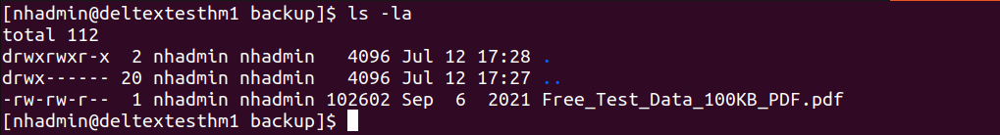
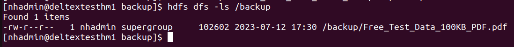
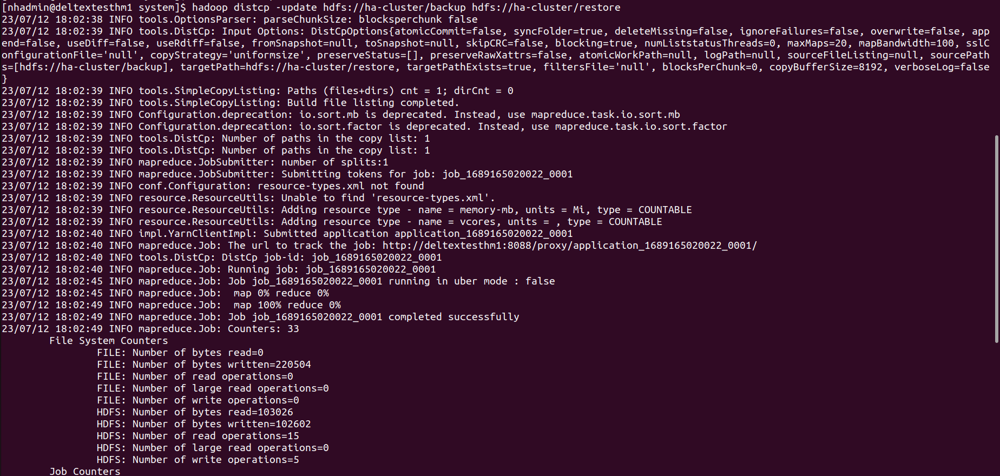
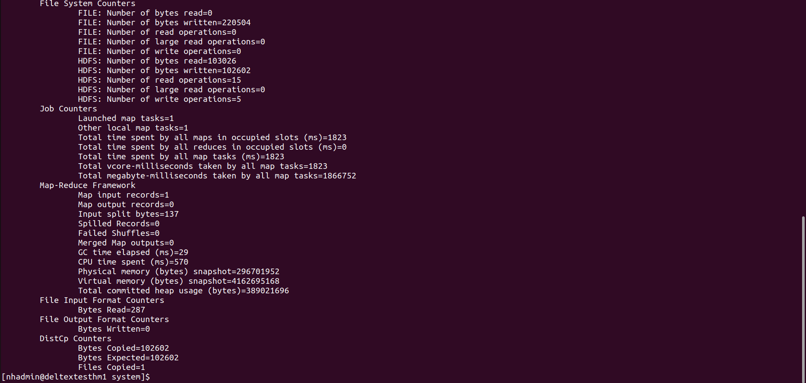
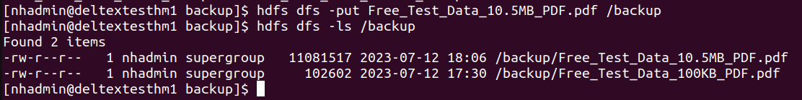
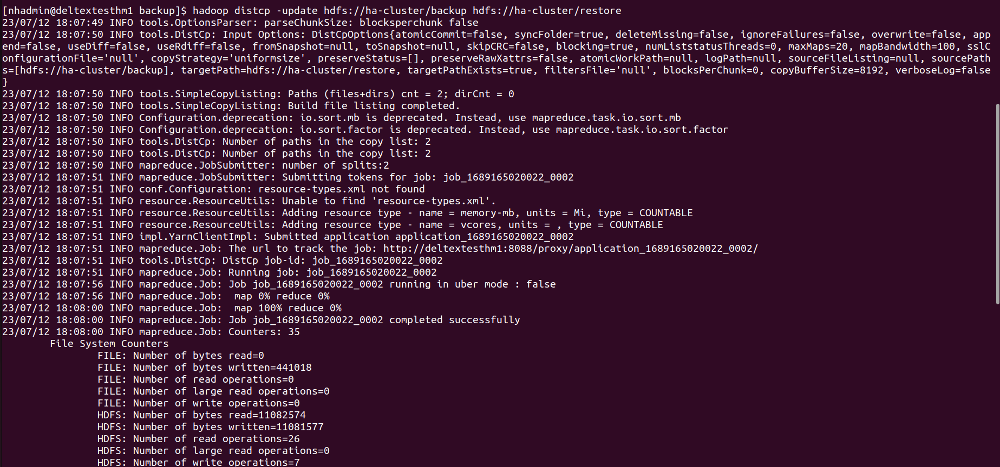
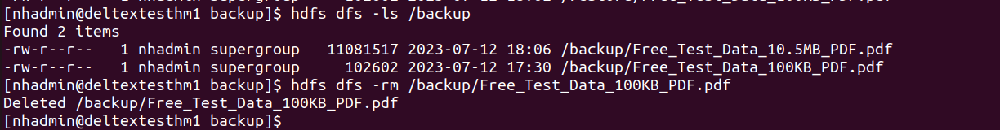
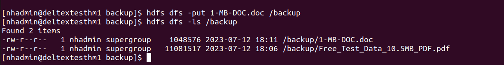
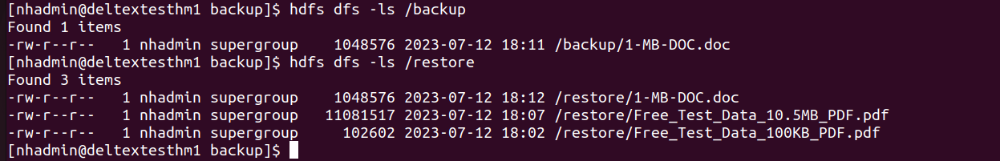

## 1 What is it?
The Apache Hadoop software library is a framework that allows for the distributed processing of large data sets across clusters of computers using simple programming models.

##### 1.Hadoop Common: 
The common utilities that support the other Hadoop modules.
##### 2.Hadoop Distributed File System (HDFS): 
A distributed file system that provides high-throughput access to application data.
##### 3.Hadoop YARN: 
A framework for job scheduling and cluster resource management.
##### 4.Hadoop MapReduce: 
A YARN-based system for parallel processing of large data sets.

## 2 Example Production Use-Cases for this database

## 3 Architecture - All Type of Architectures

##### Standalone Architecture

##### Cluster Architecture

## 4 Operator Name
Not Applicable
## 5 Operator Apporach (single/double)
Not Applicable
## 6 Minimum system requirement
| Hardware                                         | Sandbox Deployment | Basic or Standard Deployment | Advanced Deployment     |
|--------------------------------------------------|--------------------|------------------------------|-------------------------|
| CPU speed                                        | 2 - 2.5 GHz        | 2 - 2.5 GHz                  | 2.5 - 3.5 GHz           |
| Logical or virtual CPU cores                     | 16                 | 24 - 32                      | 48                      |
| Total system memory                              | 16 GB              | 64 GB                        | 128 GB                  |
| Local disk space for yarn.nodemanager.local-dirs | 256 GB             | 500 GB                       | 2.4 TB                  |
| DFS block size                                   | 128 MB             | 256 MB                       | 256 MB                  |
| HDFS replication factor                          | 3                  | 3                            | 3                       |
| Disk capacity                                    | 32 GB              | 256 GB - 1 TB                | 1.2 TB                  |
| Total number of disks for HDFS                   | 2                  | 8                            | 12                      |
| Total HDFS capacity per node                     | 64 GB              | 2 - 8 TB                     | At least 14 TB          |
| Number of nodes                                  | 2 +                | 4 - 10+                      | 12 +                    |
| Total HDFS capacity on the cluster               | 128 GB             | 8 - 80 TB                    | 144 TB                  |
| Actual HDFS capacity (with replication)          | 43 GB              | 2.66 TB                      | 57.6 TB                 |
| /tmp mount point                                 | 20 GB              | 20 GB                        | 30 GB                   |
| Installation disk space requirement              | 12 GB              | 12 GB                        | 12 GB                   |
| Network bandwidth (Ethernet card)                | 1 Gbps             | 2 Gbps (bonded channel)      | 10 Gbps (Ethernet card) |

## 7 Recommendation i.e. Memory / CPU / Disk / Network Heavy
## 8 Single Instance / Master Setup
Check Hadoop installation folder [Hadoop-HA-Installation]
## 9 Connection String for Single Instance
    "hadoop fs -Dfs.defaultFS=<A namenode IP:port> -ls / "

OR

    "hadoop fs -ls hdfs://<A namenode IP:port>/"
## 10 Active Failover
Check Hadoop installation folder [Hadoop-HA-Installation]
## 11 Multi-master setup
Check Hadoop installation folder [Hadoop-HA-Installation]
## 12 Connection String for Multi-master Instance
    hadoop fs -ls hdfs://ha-cluster:8020
##### Steps to connect via Application
1. hdfs web UI

    Namenode IP:50070

2. Resource manager web UI

    Namenode IP:8088
## 13 External Dependencies
Not Supported
## 14 Horizontal Scaling - Manual
1. Copy the Hadoop Configuration files to new node
2. Restart the hadoop system to add new node
3. Check jps for nodemanager running or not
## 15 Vertical Scaling - Manual
1. Stop the Hadoop cluster
2. Change the physical resources limits
3. Start Hadoop cluster
4. No same resource limit, will become heterogeneous cluster 
## 16 Horizontal Scaling - Automatic
Not Applicable
## 17 Vertical Scaling - Automatic
Not Applicable
## 18 Multi-region / Multi-Datacenter Support
Not Applicable
## 19 Single Instance - Backup
Not Applicable
## 20 Single Instance - Restore
Not Applicable
## 21 Cluster Backup
Not Applicable
## 22 Cluster Restore
Not Applicable
## 23 External Dependencies Backup
Not Applicable
## 24 External Dependencies Restore
Not Applicable
## 25 Data Backup
Meta-store Backup:
1. File Locations: /Namenode
2. Command based:
1. FSImage LINK
```
su - hdfs
hdfs dfsadmin -safemode enter
hdfs dfsadmin -saveNamespace
hdfs dfsadmin -fetchImage <local_dir>
hdfs dfsadmin -safemode leave
```
2. Snapshot LINK
```
hdfs dfsadmin -allowSnapshot <path>
hdfs dfs -createSnapshot <path> [<snapshotName>]
hdfs lsSnapshottableDir
```
Actual Data Backup:
1. File Locations:  /DataNode
2. Command based
```
hadoop distcp hdfs://nn1:8020/ file:///NameNode \
hdfs://nn2:8020/bar/foo
```

### Incremental backup
1. Checking Local local-file-path 

2. Checking Hdfs file path

3. Checking no files present in hdfs backup folder

4. Copy files from local-file-path to hdfs backup folder

5. List & check files inside hdfs backup folder

6. Create restore folder on other cluster or same cluster

7. Backup command on namenode

```
hadoop distcp -update hdfs://ha-cluster/backup hdfs://ha-cluster/restore
```
##### output


8. Check backup files in restore folder

9. Add more files to hdfs path

10. Again do backup process

11. Check restore path and check time & date for files

12. Delete all old files in hdfs backup path

13. Add new files to hdfs backup path

14. Check new file in hdfs path

15. Again do backup & check those files that are newer in the source directory compared to the destination directory.


## 26 Data Restore
    hdfs dfs -cp /data/dir1/.snapshot/s20180412-065533.159/imp_details.xls /data/dir1/
## 27 Migration from one database to another database
    hadoop distcp -f hdfs://nn1:8020/srclist hdfs://nn2:8020/bar/foo

Ref: https://hadoop.apache.org/docs/stable/hadoop-distcp/DistCp.html#Overview
## 28 Metrics to Monitor


##### HDFS metrics
###### NameNode-emitted metrics
* CapacityRemaining – Records the available capacity
* CorruptBlocks/MissingBlocks – Records number of corrupt/missing blocks
* VolumeFailuresTotal – Records number of failed volumes
* NumLiveDataNodes/NumDeadDataNodes – Records count of alive or dead DataNodes
* FilesTotal – Total count of files tracked by the NameNode
* Total Load – Measure of file access across all DataNodes
* BlockCapacity/BlocksTotal – Maximum number of blocks allocable/count of blocks tracked by NameNode
* UnderReplicated Blocks – Number of under-replicated blocks
* NumStaleDataNodes – Number of stale DataNodes
###### MapReduce counters
* Job counters
* Task counters
* File system counters
* FileInputFormat Counters
* FileOutput Format Counters

###### YARN metrics
* unhealthyNodes – Number of unhealthy nodes
* activeNodes – Number of currently active nodes
* lostNodes – Number of lost nodes
* appsFailed – Number of failed applications
* totalMB/allocatedMB – Total amount of memory/amount of memory allocated

###### ZooKeeper metrics
* zk_followers – Number of active followers
* zk_avg_latency – Amount of time it takes to respond to a client request (in ms)
* zk_num_alive_connections – Number of clients connected to ZooKeeper

##### Steps to setup in Prometheus
1. Install prometheus [follow this blog](https://computingforgeeks.com/install-prometheus-server-on-debian-ubuntu-linux/)
2. Install JMX exporter on namenode [follow this blog](https://github.com/prometheus/jmx_exporter)
##### Setup to setup Grafana Dashboard
1. Install Grafana [follow this blog](https://linuxhostsupport.com/blog/how-to-install-grafana-on-ubuntu-20-04/)
2. Create Grafana Dashboard and this jmx id 3457
3. Select metric server ip as prometheus ip & port

## 29 Query Log
Not Applicable
## 30 Event / Audit Log
##### Default Log files and their importance
    $Hadoop_Home_folder/logs
##### Default Log path
    $Hadoop_Home_folder/logs
## 31 Data Loss / Fault Tolerant
Not Applicable
## 32 Client to Server Encrypted Connection
Not Applicable
## 33 Encrypted Connection between internal components of database
Not Applicable
## 34 Configuration (i.e. Config file) Best Practices
Not Applicable
## 35 Security Best Practices
Not Applicable
## 36 Upgrade / Downgrade without downtime
Not Applicable
## 37 K8s Deployment
## 38 K8s Best Practices for this database
## 39 Default Alarms
## 40 Out of box - Health Check
## 41 Out of box - Log Rotation Policy
## 42 Important Errors / Exceptions and their meaning
## 43 Slow Query / Performance Logs
## 44 Reporting
## 45 Most Used Commands (Cheatsheet)
## 46 Multiple namespace deployment 
## 47 Code / Config / Docker Image pushed into GitLab
## 53 Heavy Data injestion and query
## 54 Load testing (Any tool supported by respective Db)
## 55 RBAC 
## 56 Alerts on important metrics
## 57 Best practices for respective databases
## 58 Custom grafana dashboard  (If need)
## 59 Security best pratices
## 60 Audit logs
## 61 Upgrade & Downgrade 
## 62 Health Check alarm

